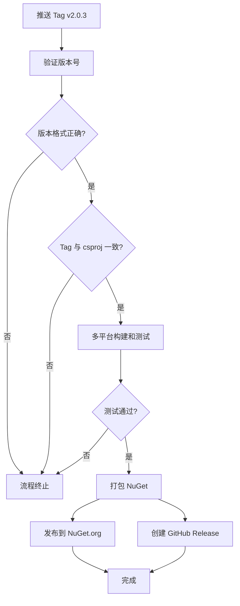

# 自动化发布系统说明 / Automated Release System Documentation

本文档概述 Excel2Object 项目的自动化发布系统，包括 Copilot 指令、版本管理和发布流程。

This document provides an overview of the Excel2Object project's automated release system, including Copilot instructions, version management, and release workflows.

---

## 📚 文档索引 / Documentation Index

### 1. GitHub Copilot 使用说明 / Copilot Instructions
**文件位置 / File Location**: [`.github/copilot-instructions.md`](.github/copilot-instructions.md)

**内容概要 / Summary**:
- 项目简介和核心功能
- 技术栈和依赖
- 编码规范和命名约定
- 开发指南和测试要求
- 提交和 PR 规范
- 常见问题解答

**适用对象 / Target Audience**: 所有使用 GitHub Copilot 进行开发的贡献者

---

### 2. 版本管理规范 / Versioning Guidelines
**文件位置 / File Location**: [`.github/VERSIONING.md`](.github/VERSIONING.md)

**内容概要 / Summary**:
- 语义化版本（SemVer）说明
- 版本号递增规则
  - 主版本号 (Major): 不兼容的 API 变更
  - 次版本号 (Minor): 向后兼容的功能新增
  - 修订号 (Patch): 向后兼容的问题修正
- 版本管理流程
- 预发布版本规范

**适用对象 / Target Audience**: 维护者和发布管理员

**关键规则 / Key Rules**:
```
Bug 修复    → Patch +1  (2.0.2 → 2.0.3)
新功能      → Minor +1  (2.0.3 → 2.1.0)
破坏性变更  → Major +1  (2.1.0 → 3.0.0)
```

---

### 3. 发布流程指南 / Release Process Guide
**文件位置 / File Location**: [`.github/RELEASE_GUIDE.md`](.github/RELEASE_GUIDE.md)

**内容概要 / Summary**:
- 自动化发布流程详解
- 发布步骤说明
  - 准备阶段：版本号更新、发布说明编写
  - 发布阶段：Tag 创建、自动化监控
- 预发布版本处理
- 配置要求（Secrets、Environments）
- 故障排查和回滚指南
- 最佳实践建议

**适用对象 / Target Audience**: 发布管理员

---

### 4. 发布工作流 / Release Workflow
**文件位置 / File Location**: [`.github/workflows/release.yml`](.github/workflows/release.yml)

**触发条件 / Trigger**: 推送 `v*` 格式的 Git Tag（例如 `v2.0.3`）

**工作流程 / Workflow Steps**:



**作业清单 / Jobs**:
1. ✓ `validate-version`: 验证版本号格式和一致性
2. ✓ `build-and-test`: 在 Ubuntu 和 Windows 上构建和测试
3. ✓ `pack-nuget`: 打包 NuGet 包
4. ✓ `publish-nuget`: 发布到 NuGet.org
5. ✓ `create-release`: 创建 GitHub Release
6. ✓ `notify-success`: 发布成功通知

---

## 🚀 快速开始 / Quick Start

### 发布新版本 / Releasing a New Version

#### 方法一：使用自动化脚本（推荐）/ Method 1: Using Automation Script (Recommended)

**一键发布 / One-Click Release**:

```powershell
# Windows
.\release.ps1 -Version 2.0.4

# Linux/macOS (需要 PowerShell Core)
pwsh ./release.ps1 -Version 2.0.4
```

该脚本会自动完成以下所有步骤 / This script automatically completes all the following steps:
- ✓ 更新 csproj 版本号 / Update csproj version
- ✓ 提交代码 / Commit changes
- ✓ 创建 Tag / Create tag
- ✓ 推送到远程仓库 / Push to remote

详细参数和用法请参阅 [工具和脚本](#工具和脚本--tools-and-scripts) 章节。

See [Tools and Scripts](#工具和脚本--tools-and-scripts) section for detailed parameters and usage.

---

#### 方法二：手动发布 / Method 2: Manual Release

**步骤 / Steps**:

1. **更新版本号** / Update Version Number
   ```bash
   # 编辑 Chsword.Excel2Object/Chsword.Excel2Object.csproj
   # <Version>2.0.3</Version>
   ```

2. **更新发布说明** / Update Release Notes
   ```bash
   # 在 README.md 和 README_EN.md 中添加版本信息
   ```

3. **提交并推送** / Commit and Push
   ```bash
   git add .
   git commit -m "chore: bump version to 2.0.3"
   git push origin main
   ```

4. **创建并推送 Tag** / Create and Push Tag
   ```bash
   git tag v2.0.3
   git push origin v2.0.3
   ```

5. **监控发布** / Monitor Release
   - 访问 GitHub Actions: https://github.com/chsword/Excel2Object/actions
   - 等待约 5-10 分钟
   - 验证 NuGet 和 GitHub Release

---

## ⚙️ 配置要求 / Configuration Requirements

### GitHub Secrets

必需配置 / Required:

| Secret 名称 | 描述 | 获取方式 |
|------------|------|---------|
| `NUGET_API_KEY` | NuGet.org API 密钥 | 登录 NuGet.org → Account Settings → API Keys |

**配置路径 / Configuration Path**: 
```
GitHub 仓库 → Settings → Secrets and variables → Actions → New repository secret
```

### GitHub Environments

可选环境 / Optional Environment: `nuget-production`

**用途 / Purpose**: 
- 提供发布前的审批流程
- 控制 NuGet 发布权限

**配置路径 / Configuration Path**:
```
GitHub 仓库 → Settings → Environments → New environment
```

---

## 🔍 版本号自增规则详解 / Version Increment Rules Detail

### 编译时版本号规则 / Build-time Version Rules

项目使用 MSBuild 和 .NET SDK 的标准版本管理机制：

1. **手动版本号管理** / Manual Version Management
   - 版本号在 `.csproj` 文件的 `<Version>` 标签中手动维护
   - 当前格式：`主版本.次版本.修订版` (例如: `2.0.2`)

2. **自动程序集版本** / Automatic Assembly Version
   - 编译时，NuGet 包版本自动从 `<Version>` 标签读取
   - 程序集版本 (AssemblyVersion) 和文件版本 (FileVersion) 自动生成

3. **版本号验证** / Version Validation
   - GitHub Actions 在发布时自动验证版本号：
     - ✓ SemVer 格式验证
     - ✓ Tag 版本与 csproj 版本一致性检查
     - ✓ 防止重复发布相同版本

### 版本递增决策表 / Version Increment Decision Matrix

| 变更类型 | 示例 | 版本递增 | 示例版本 |
|---------|------|---------|---------|
| 修复 Bug | 修复空值异常 | Patch +1 | 2.0.2 → 2.0.3 |
| 性能优化 | 提升导出速度 | Patch +1 | 2.0.3 → 2.0.4 |
| 新增功能 | 支持新的 Excel 格式 | Minor +1 | 2.0.4 → 2.1.0 |
| 新增框架支持 | 支持 .NET 10.0 | Minor +1 | 2.1.0 → 2.2.0 |
| API 破坏性变更 | 删除废弃方法 | Major +1 | 2.2.0 → 3.0.0 |
| 架构重构 | 重写核心引擎 | Major +1 | 3.0.0 → 4.0.0 |

### 预发布版本规范 / Pre-release Version Specification

| 阶段 | 版本格式 | 用途 |
|-----|---------|-----|
| Alpha | `2.1.0-alpha.1` | 早期开发版本，功能不完整 |
| Beta | `2.1.0-beta.1` | 功能完整，可能有 Bug |
| RC | `2.1.0-rc.1` | 候选发布版，准备正式发布 |

---

## 📊 发布检查清单 / Release Checklist

发布前请确认 / Before Release, Please Confirm:

- [ ] 所有单元测试通过
- [ ] 代码已经过 Code Review
- [ ] 版本号已更新（csproj）
- [ ] 发布说明已更新（README.md + README_EN.md）
- [ ] 示例代码与新版本兼容
- [ ] 文档已同步更新
- [ ] 破坏性变更已明确标注
- [ ] 在本地测试了 NuGet 包的构建

发布后检查 / After Release, Verify:

- [ ] NuGet.org 上可以搜索到新版本
- [ ] GitHub Release 已创建
- [ ] Release 包含正确的发布说明
- [ ] NuGet 包可以正常安装和使用

---

## 🛠️ 工具和脚本 / Tools and Scripts

### 自动化发布脚本 / Automated Release Script

**脚本位置 / Script Location**: `release.ps1`

这是一个 PowerShell 脚本，可以一键完成版本更新、代码提交和 Tag 创建的全部流程。

This is a PowerShell script that automates the entire process of version update, code commit, and tag creation.

**基本用法 / Basic Usage**:

```powershell
# Windows
.\release.ps1 -Version 2.0.4

# Linux/macOS (需要安装 PowerShell Core)
pwsh ./release.ps1 -Version 2.0.4
```

**参数说明 / Parameters**:

| 参数 | 必需 | 说明 |
|------|------|------|
| `-Version` | 是 | 新版本号，格式：主版本.次版本.修订版 (例如: 2.0.3) |
| `-SkipPush` | 否 | 仅创建本地提交和标签，不推送到远程仓库 |
| `-Force` | 否 | 强制执行，跳过所有确认提示 |

**使用示例 / Examples**:

```powershell
# 发布新版本 2.0.4（会提示确认）
.\release.ps1 -Version 2.0.4

# 仅本地提交，不推送到远程
.\release.ps1 -Version 2.1.0 -SkipPush

# 强制执行，跳过确认提示
.\release.ps1 -Version 3.0.0 -Force

# 组合参数使用
.\release.ps1 -Version 2.0.5 -SkipPush -Force
```

**脚本执行流程 / Script Workflow**:

1. ✓ 验证版本号格式（必须符合语义化版本）
2. ✓ 检查 Git 仓库状态
3. ✓ 检查 Tag 是否已存在
4. ✓ 更新 `Chsword.Excel2Object.csproj` 中的版本号
5. ✓ 提交代码：`git commit -m "chore: bump version to X.Y.Z"`
6. ✓ 创建 Git Tag：`git tag vX.Y.Z`
7. ✓ 推送到远程仓库（除非使用 `-SkipPush`）

**注意事项 / Notes**:

- 脚本会自动检查工作目录是否有未提交的更改
- 如果 Tag 已存在，脚本会报错并提示如何删除
- 推送后会自动触发 GitHub Actions 的发布流程
- Windows 用户可能需要设置 PowerShell 执行策略：`Set-ExecutionPolicy -ExecutionPolicy RemoteSigned -Scope CurrentUser`

---

### 本地测试 NuGet 包构建 / Test NuGet Package Build Locally

```bash
# 清理之前的构建
dotnet clean

# 恢复依赖
dotnet restore

# 构建 Release 版本
dotnet build --configuration Release

# 打包 NuGet
dotnet pack --configuration Release --output ./artifacts

# 查看生成的包
ls -lh ./artifacts/*.nupkg
```

### 验证版本号一致性 / Verify Version Consistency

```bash
# 提取 csproj 中的版本号
CSPROJ_VERSION=$(grep -oP '(?<=<Version>)[^<]+' Chsword.Excel2Object/Chsword.Excel2Object.csproj)
echo "Project Version: $CSPROJ_VERSION"

# 如果计划发布，确保创建匹配的 tag
# git tag v$CSPROJ_VERSION
```

---

## 📝 相关资源 / Related Resources

### 官方文档 / Official Documentation
- [语义化版本规范 (SemVer)](https://semver.org/lang/zh-CN/)
- [NuGet 文档](https://docs.microsoft.com/zh-cn/nuget/)
- [GitHub Actions 文档](https://docs.github.com/cn/actions)

### 项目链接 / Project Links
- [项目主页](https://github.com/chsword/Excel2Object)
- [NuGet 包](https://www.nuget.org/packages/Chsword.Excel2Object)
- [问题跟踪](https://github.com/chsword/Excel2Object/issues)
- [发布页面](https://github.com/chsword/Excel2Object/releases)

---

## 💡 最佳实践总结 / Best Practices Summary

1. **遵循 SemVer**: 严格按照语义化版本规范管理版本号
2. **及时更新文档**: 每次发布前更新 README 和发布说明
3. **充分测试**: 发布前在所有支持的框架上运行测试
4. **保持一致性**: 确保 Tag 版本、csproj 版本和发布说明一致
5. **小步快跑**: 频繁发布小的改进，而不是积累大量变更
6. **向后兼容**: 尽可能保持 API 向后兼容，减少破坏性变更
7. **清晰沟通**: 在发布说明中清楚说明所有变更和破坏性改动

---

## 📮 联系方式 / Contact

如有问题或建议，请通过以下方式联系：

For questions or suggestions, please contact via:

- **GitHub Issues**: https://github.com/chsword/Excel2Object/issues
- **GitHub Discussions**: https://github.com/chsword/Excel2Object/discussions
- **Email**: chsword@126.com

---

**最后更新 / Last Updated**: 2025-10-11
